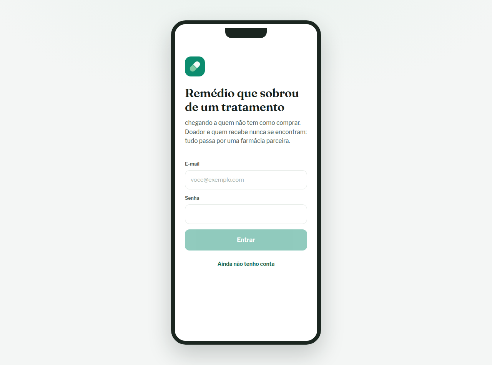
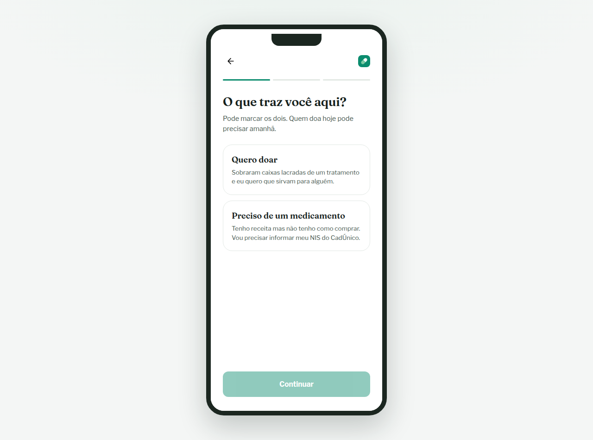
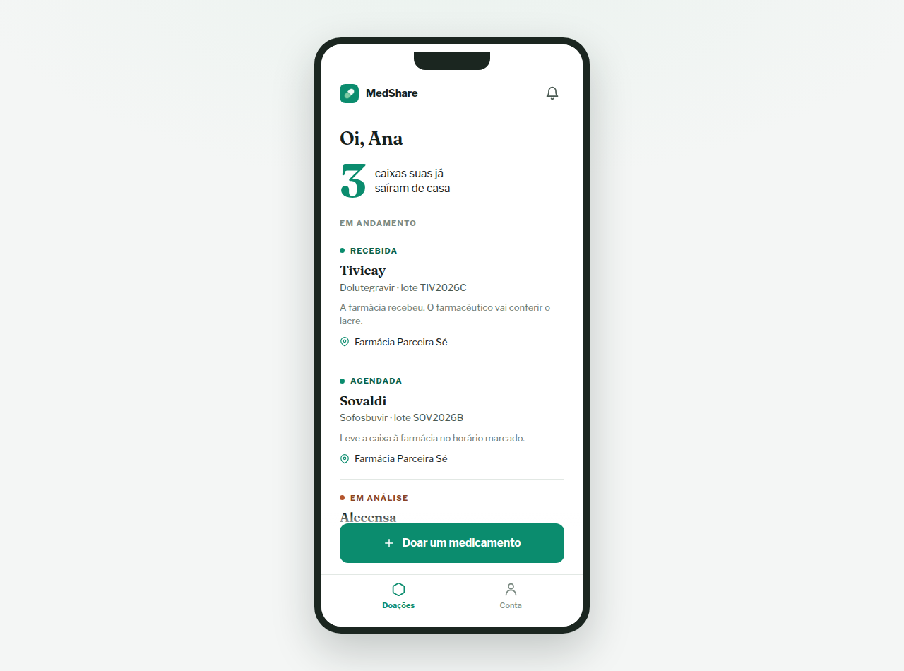
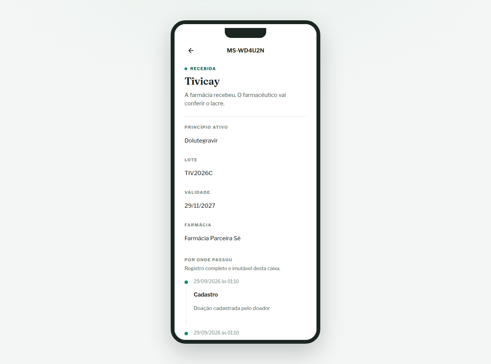
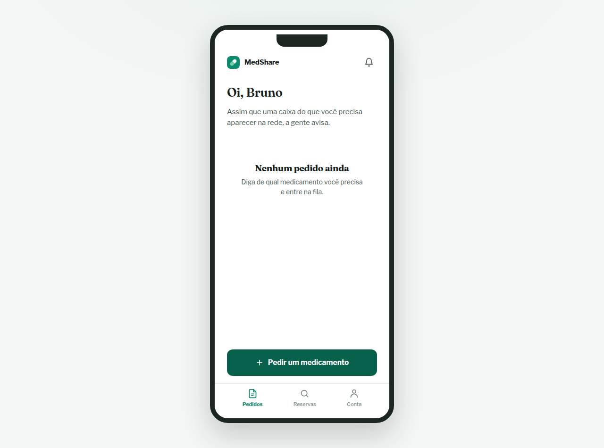
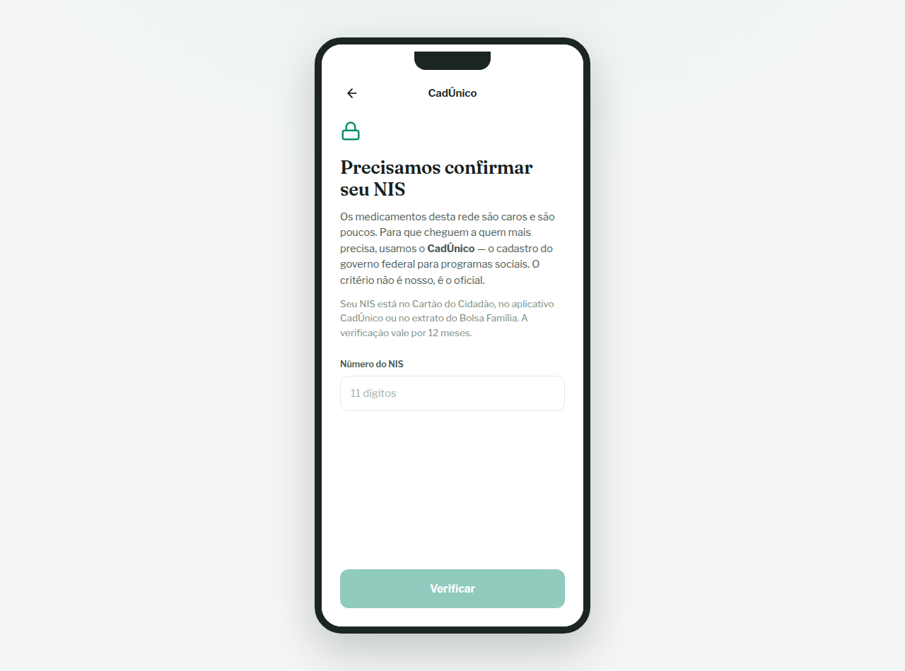
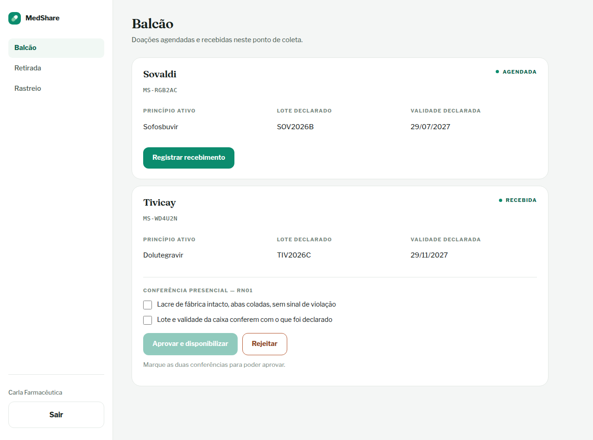

<p align="center">
  
</p>

<h1 align="center">MedShare</h1>

<p align="center">
  Rede de doação de medicamentos de alto custo na Grande São Paulo.<br>
  <em>Trabalho de Modelagem de Software — USJT</em>
</p>

---

Quem terminou um tratamento e ficou com caixas lacradas doa. Quem não tem
condições de comprar recebe. **Doador e beneficiário nunca se encontram**:
tudo passa por uma farmácia parceira, onde um farmacêutico confere cada caixa
antes de ela seguir adiante.

O produto é um **aplicativo Android**. O painel web existe para a farmácia e
para a central de análise, que trabalham no computador.

## As telas

| | | |
|:--:|:--:|:--:|
| <br>**Entrada** | <br>**Cadastro** | <br>**Quem doa** |
| <br>**Rastreio da caixa** | <br>**Quem recebe** | <br>**CadÚnico (RN08)** |

<p align="center">
  <br>
  <em>O balcão da farmácia — tela de computador, que é onde o farmacêutico trabalha.</em>
</p>

Capturas do sistema rodando de verdade, não desenho.

## O cadastro decide o caminho

A primeira coisa que a pessoa escolhe é **o que ela veio fazer**, antes de
digitar qualquer dado — porque é essa escolha que define o resto:

- **Quero doar** → não precisa de NIS. Doar remédio não exige provar pobreza.
- **Preciso de um medicamento** → precisa do NIS (RN08), e cai direto na tela
  de verificação depois de criar a conta.

Dá para marcar os dois. Quem acumula papéis escolhe a área pelo menu.

## Onde cada regra de negócio vive no código

Uma regra escrita só na documentação é uma regra que um dia alguém esquece.
Cada uma das dez está implementada em **pelo menos dois lugares** — no objeto
de domínio e no banco — e coberta por teste.

| Regra | O que diz | Onde está no código | Onde está no banco |
|---|---|---|---|
| **RN01** | Só embalagem lacrada | `Validacao.aprovar()` | `validacao_aprovada_exige_lacre` |
| **RN02** | Mínimo 30 dias de validade | `Doacao.cadastrar()` | gatilho `trg_doacao_prazo_minimo` |
| **RN03** | Retirada só com receita válida | `Necessidade.exigirReceitaValida()`, `Entrega` | `entrega_exige_conferencia` |
| **RN04** | Uma reserva ativa por medicamento | `ServicoDeReserva` | `uq_necessidade_ativa`, `uq_reserva_necessidade_ativa` |
| **RN05** | Doador e beneficiário não se encontram | `DoacaoResumida`, `ReservaResumida` (nenhum expõe o outro lado) | — |
| **RN06** | Histórico completo e imutável | `EventoHistorico` (sem setters) | gatilho `trg_historico_imutavel` |
| **RN07** | Só medicamento com PMC ≥ R$ 150 | `Medicamento.atendeAoPisoDePreco()` | coluna calculada `alto_custo` |
| **RN08** | Beneficiário com NIS ativo no CadÚnico | `ValidadorDeNis`, `ConsultaNoPortalDaTransparencia` | `verificacao_cadunico` |
| **RN09** | Endereços na Grande São Paulo | `ServicoDeAutenticacao.cadastrar()` | chave estrangeira para `municipio_rmsp` |
| **RN10** | A IA nunca decide sozinha | `RegraDeDecisaoDaPreValidacao` | `analise_pre_validacao` + `revisao_central` |

O banco é a última linha de defesa. Mesmo que um bug passe pela aplicação — ou
que alguém rode um `UPDATE` na mão — o dado inválido não entra.

## Ciclo de vida da doação

```
Cadastrada → PreValidada → Agendada → Recebida → Validada → Disponível → Reservada → Entregue
```

Desvios: `EmAnaliseCentral` (RN10), `Recusada`, `Cancelada`, `Rejeitada`,
`Descartada`, e o retorno `Reservada → Disponível` quando a reserva expira.

A máquina de estados mora no enum `StatusDoacao`: cada estado carrega a lista
de estados para os quais pode ir. Não existe transição feita com `if` espalhado
por service — para saber se um passo é válido, pergunta-se ao próprio estado.

## Sobre o NIS (RN08)

**Não existe API pública do CadÚnico.** Isso não é limitação do projeto: o
governo não publica uma. O que existe de graça e oficial é a consulta de
pagamentos do Bolsa Família por NIS, no Portal da Transparência.

Então o sistema faz três coisas, nesta ordem:

1. **Confere o dígito verificador** do NIS (pesos 3,2,9,8,7,6,5,4,3,2 mod 11).
   Número mal formado é recusado na hora — não gasta consulta nem tempo de
   ninguém.
2. **Consulta o Portal da Transparência.** Achou pagamento, está confirmado.
3. **Não achou → vai para conferência humana na central.** Nunca é recusa.

O terceiro passo é a parte que importa. A consulta oficial só enxerga quem
recebe Bolsa Família, e existe gente no CadÚnico que não recebe. Recusar essa
pessoa seria o critério oficial excluindo exatamente quem ele deveria incluir.
Falha de rede também cai nesse caminho: erro de integração nunca vira negativa
para o cidadão.

## Sobre a IA (RN10)

A leitura automática da foto da embalagem tem **uma única coisa** que pode
fazer sozinha: deixar passar o caso obviamente correto. Ela não recusa nada.

Para seguir sem humano, precisam valer ao mesmo tempo: a caixa parecer lacrada,
a certeza ser alta, os três campos (código de barras, lote e validade) terem
sido lidos, e nenhum divergir do que o doador digitou. Falhando qualquer uma
dessas condições, o caso vai para a central e uma pessoa decide, com
justificativa registrada no histórico.

Falha de integração — timeout, erro, resposta estranha — também cai na central.
Nenhum caminho de erro aprova nada.

**A foto da receita nunca é enviada para a IA.** Só a foto da caixa, sem nome,
sem CPF, sem nada do doador ou do beneficiário.

Fase 1 usa a API do Gemini. Cada análise fica gravada, inclusive quando erra;
comparada depois com a decisão do farmacêutico, vira um exemplo rotulado de
graça — o conjunto de dados da fase 2, um classificador próprio.

## Stack

| Camada | Escolha | Por quê |
|---|---|---|
| Back-end | Java 21 + Spring Boot 3.3 | maduro, documentado em português, gratuito |
| Banco | PostgreSQL 16 | constraints e gatilhos que sustentam as RNs |
| Migrations | Flyway | esquema versionado no Git |
| Segurança | Spring Security + JWT | sem sessão no servidor |
| App | Kotlin + Jetpack Compose | Android, sem taxa anual |
| Painel | React + TypeScript + Vite | erro de contrato vira erro de compilação |
| Fotos | Cloudflare R2 | 10 GB grátis permanentes, sem cartão |
| Infra | Docker + Oracle Always Free | não hiberna |
| CI/CD | GitHub Actions | grátis em repositório público |

Custo total: **R$ 0,00**. Toda peça tem camada gratuita permanente ou é código
aberto.

## Estrutura

```
medshare-api/            back-end
└── src/main/java/br/com/medshare/
    ├── comum/           erros, endereço, propriedades, carga de demonstração
    ├── usuario/         Usuario, Papel, Municipio (RN09)
    ├── seguranca/       JWT, filtro, papéis
    ├── medicamento/     catálogo CMED (RN07)
    ├── farmacia/        PontoDeColeta, Farmaceutico
    ├── doacao/          Doacao, StatusDoacao, EventoHistorico (RN01, RN02, RN06)
    ├── prevalidacao/    análise da IA e revisão da central (RN10)
    ├── necessidade/     pedido, receita, CadÚnico (RN03, RN08)
    ├── reserva/         matching, reserva, entrega (RN04, RN05)
    ├── notificacao/     avisos e push
    └── integracao/      Gemini, ViaCEP, Portal da Transparência, R2

medshare-app/            o aplicativo Android
└── app/src/main/java/br/com/medshare/app/
    ├── dados/           Retrofit, modelos, sessão, repositório
    ├── ui/              componentes e tema
    └── telas/           login, cadastro, início, doação, rastreio,
                         agendamento, CadÚnico, pedido, receita

medshare-painel/         painel da farmácia e da central
└── src/
    ├── api/             cliente HTTP e tipos da API
    ├── contexto/        sessão
    ├── componentes/     moldura do app, status, avisos, ícones
    ├── app/             as telas do cidadão, em moldura de celular
    └── paginas/         login, cadastro, balcão, retirada, central, rastreio
```

## Para começar

- **Rodar na sua máquina:** [`COMO-RODAR.md`](COMO-RODAR.md)
- **Gerar e distribuir o APK:** [`PUBLICAR-O-APP.md`](PUBLICAR-O-APP.md)

## Testes

```bash
cd medshare-api && ./gradlew test
```

85 testes, sem banco e sem rede: cada regra de negócio é testada tentando
violá-la de propósito.

## Segurança

Nenhuma chave, senha ou certificado está neste repositório. Tudo vem de
variável de ambiente:

- `medshare-api/.env.exemplo` — copie para `.env` e preencha. O
  `CarregadorDoEnv` lê esse arquivo na subida, e variável de ambiente de
  verdade continua ganhando dele — um `.env` esquecido no servidor não
  sobrescreve credencial de produção.
- `medshare-app/keystore.properties.exemplo` — copie para `keystore.properties`

O `.env`, o `keystore.properties` e o `medshare.keystore` estão no
`.gitignore` desde o primeiro commit.
